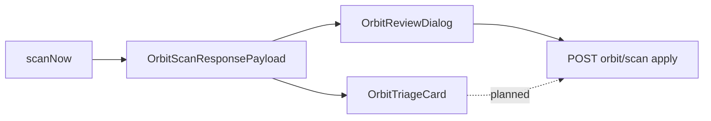

# Orbit Grok sorting — implementation plan

## Current shape (for alignment)

- Scan returns [`OrbitScanResponsePayload`](src/types/index.ts): `plan`, `summary`, `tagRollups`, `collectionRollups`, plus privacy/model metadata. The hook stores this on [`useOrbitScan`](src/hooks/use-orbit-scan.ts) as `plan` (naming is overloaded: it is the **full** payload).
- Cards derive compact actions via [`derivePrimaryAndAlternative`](src/lib/orbit-decision.ts), which drops extra tags from the visible surface.
- Apply paths: [`POST /api/orbit/scan`](src/app/api/orbit/scan/route.ts) with `mode: "apply"` and [`applyOrbitScanPlan`](src/lib/orbit-grok.ts). Per-item apply exists in the hook but **is not used** from the UI; [`applyEntirePlan`](src/hooks/use-orbit-scan.ts) is also **unused** on pages.

---

## Phase 1 — Correctness and honest confidence (small, low risk)

**1.1 Fix `createCollections` for per-item apply**

In [`use-orbit-scan.ts`](src/hooks/use-orbit-scan.ts) `applySuggestion`, replace `createCollections: variant === "primary"` with logic derived from the **filtered plan** you are about to send: set `true` if any suggestion in that plan has `collection` with `reuseExisting === false` (new bucket), else `false`. Reuse the same rule for `buildSingleSuggestionPlan` outputs (collection-only or tag-only).

**1.2 Confidence UX without fake precision**

In [`orbit-decision.ts`](src/lib/orbit-decision.ts), replace percent-style helpers with qualitative labels (e.g. high → “Strong match”, medium → “Reasonable guess”, low → “Uncertain”). Update [`orbit-triage-card.tsx`](src/components/orbit/orbit-triage-card.tsx) and [`orbit-focus-strip.tsx`](src/components/orbit/orbit-focus-strip.tsx) to show label + short tooltip rather than `91%` style copy.

**1.3 Tests**

Update [`orbit-decision.test.ts`](src/lib/orbit-decision.test.ts) expectations. Add a focused test (or extend [`orbit-grok-apply.test.ts`](src/lib/orbit-grok-apply.test.ts) / hook-level test if present) that documents the createCollections rule for apply payloads.

---

## Phase 2 — Pass overview, rollups, and richer cards

**2.1 Overview + rollup strip on Orbit**

On [`orbit/page.tsx`](src/app/(main)/orbit/page.tsx), when `scan.plan` is non-null, render a compact **collapsible** block below the existing “Categorize unsorted” header (same column width as the queue):

- **Grok overview**: `scan.plan.plan.overview.summary` plus optional sublines for `taggingStrategy` / `collectionStrategy` (truncated with “show more” if long).
- **Rollups**: horizontal chips from `scan.plan.tagRollups` (name, color dot, count; indicate existing vs new via `reuseExisting`) and `scan.plan.collectionRollups` (name, count).
- **Summary counts**: optional one-liner from `scan.plan.summary` (e.g. bookmarks with tags vs collections) so the pass is legible before opening Review.

Use existing typography/panel patterns from the orbit header (mono label, `border-white/10`-style panels) for consistency.

**2.2 Show all suggested tags on the card**

Extend [`OrbitBookmarkDecision`](src/types/index.ts) (or pass a parallel prop) to include tag names beyond primary/alt — computed when building the decision from the raw suggestion (e.g. `allTagNames` or `additionalTagNames`). Update [`buildBookmarkDecision`](src/lib/orbit-decision.ts) and [`OrbitTriageCard`](src/components/orbit/orbit-triage-card.tsx) to show a muted row of chips or “+N more” expander so users see the full Grok output without opening Review.

**2.3 Actionable alternative**

In [`OrbitTriageCard`](src/components/orbit/orbit-triage-card.tsx), replace the non-interactive alt `` with a secondary control:

- **Apply alternative**: calls `scan.applySuggestion(bookmarkId, "alt")` (after Phase 1 fix), with loading/disable consistent with Review.
- Optional: **Review with alt** could open the dialog with that bookmark focused (already supported via `focusBookmarkId`).

Wire new callbacks from [`orbit/page.tsx`](src/app/(main)/orbit/page.tsx) (toast on success using existing `formatAppliedToast` pattern; errors via existing `scan.error` → toast effect).

---

## Phase 3 — Review dialog: library-aware editing

There is no standalone `combobox` component; use existing [`popover.tsx`](src/components/ui/popover.tsx) + [`command.tsx`](src/components/ui/command.tsx) (shadcn-style) **inside** [`orbit-review-dialog.tsx`](src/components/orbit/orbit-review-dialog.tsx):

**3.1 Tags**

Replace the single comma-separated `Input` with:

- A multi-value pattern: Command list filtered by `existingTags`; selecting inserts into a list of chips; allow **free-text add** for new names (still capped at 3 tags to match backend rules, mirroring [`splitTagNames`](src/lib/orbit-review.ts)).

**3.2 Collection**

Replace free-text collection `Input` with Command against `existingCollections`, plus explicit **“Custom / new name”** path that falls back to string entry (same as today) so behavior stays backward-compatible.

**3.3 Keep `buildReviewedOrbitPlan` as source of truth**

No change required to [`orbit-review.ts`](src/lib/orbit-review.ts) beyond ensuring color/reuse flags still resolve when names are picked from the library (existing logic largely already maps by normalized key).

---

## Phase 4 — Stale plan, latency, fast paths

**4.1 Stale plan banner**

On successful `scanNow`, store a **context fingerprint** in component state, e.g. `{ queryString, orbitView, page, mode: "queue" | "selection", selectionSignature }` (for selection: sorted joined ids used for that scan). Whenever `scan.plan` is set and the current fingerprint differs, show an inline banner above the queue: explain the pass was run on a different view and offer **Dismiss plan** → `scan.clearPlan()`.

**4.2 Scan latency affordance**

When starting `handleScan`, optional non-blocking `toast.info` or persistent inline subtext under the button (“Large queues can take a minute…”) so users do not double-submit; ensure the button stays disabled while `scan.scanning` (already partly true).

**4.3 Apply high-confidence subset**

Add a hook helper, e.g. `applyPlanSubset({ minConfidence: "high" } | { bookmarkIds })`, that builds a filtered `OrbitScanPlan` (same `overview`, suggestions filtered, excluded dismissed) and POSTs `mode: "apply"` with `createCollections` derived from whether any included suggestion introduces a new collection (`reuseExisting === false`). Expose a tertiary control next to **Review pass** (e.g. **Apply strong matches**) only when at least one suggestion has `confidence === "high"` and non-empty applyable payload. Confirm empty filtered plan is a no-op with clear toast.

---

## Out of scope (defer unless you want them in this PR)

- **Cross-page / cross-batch collection clustering**: changing [`normalizeOrbitScanPlan`](src/lib/orbit-grok.ts) rules or persisting “pending” collection names across scans is a product decision with DB or session state — not required for the UI/API fixes above.
- **Wiring [`applyEntirePlan`](src/hooks/use-orbit-scan.ts) in the main UI**: overlaps with “Apply strong matches” / review; can remain unused or be exposed later as “Apply all remaining in pass without review” with a confirmation dialog.

---

## Verification

- Manual: run Orbit scan, confirm overview/rollups visible; apply primary, apply alt (tag + collection cases), apply high-confidence; change search/page and see stale banner; edit review with library pickers and apply.
- Automated: `orbit-decision` tests; any existing orbit API tests; run project typecheck/lint per [`check-compiler-errors`](AGENTS.md) skill if needed.
