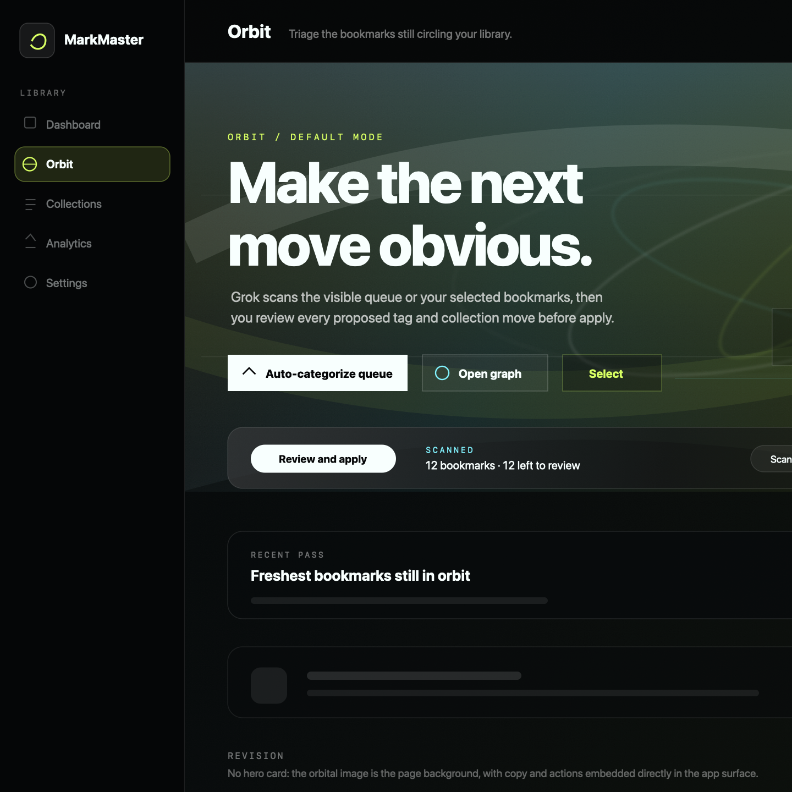

<div align="center">
  
  <h1>MarkMaster</h1>
  <p><strong>Search, tag, annotate, and curate your X bookmarks</strong> — with collections, analytics, Grok-powered triage, and a local archive that stays searchable after sync.</p>

  <p>
    <a href="https://github.com/jonnydry/MarkMaster/actions/workflows/ci.yml">
      
    </a>
    <a href="LICENSE">
      
    </a>
    
    
    
  </p>
</div>

---

## ✨ What is MarkMaster?

MarkMaster is a **bookmark manager built for people who save a lot on X** and need to **find, organize, and act on** what they kept. Your library syncs into PostgreSQL, stays full-text searchable, and gains structure through tags, collections, notes, and optional Grok-assisted workflows.

<div align="center">
  
  <p><em>The Orbit Map — a force-directed graph of your tags, collections, and bookmark relationships</em></p>
</div>

---

## 🚀 Features

### 📚 Library & Search
- **Full-text search** across tweet text, authors, and notes
- Sort and filter by date, engagement, media type, author, and tags
- Custom tags with colors; notes per bookmark
- **Keyboard shortcuts** — `j`/`k` navigate, `/` search, `⌘K` command palette, `t` tag, `c` collect, `n` note
- Export to JSON or CSV with metadata

### 🗂️ Organization
- **Collections** with drag ordering and public `/share/[slug]` pages
- **X folder sync** — import premium bookmark folders into managed collections
- Incremental sync with encrypted token storage and local archive

### 🤖 Orbit & Grok (optional)
- Batch Grok scans with adaptive sizing (quick / balanced / deep)
- Review overlay to accept, edit, or keep suggestions before applying
- Strong-match auto-apply, author history hints, and decision telemetry
- Flywheel flows from Discovery → Orbit review with digest batches

### 🎨 Presentation
- Dark / light themes with accent presets and typography options (Orbit, Classic, Editorial)
- Frosted app chrome aligned across dashboard, collections, and Orbit
- Command palette for fast navigation and actions

---

## 🏗️ Architecture Overview

| Module | What it does |
|--------|-------------|
| **Dashboard** | Browse, search, filter, and sort your full library with feed / compact / grid views |
| **Discovery** | Surface high-engagement untouched saves and batch-review them in Orbit |
| **Orbit** | Triage queue for unorganized bookmarks — Grok suggests tags and collections |
| **Orbit Map** | Force-directed graph of tags, collections, and bookmark relationships |
| **Collections** | Curated lists with manual ordering and public share links |
| **Analytics** | Authors, content mix, engagement trends, and library health |
| **Settings** | Sync, export, typography presets, themes, and Grok configuration |

---

## 🛠️ Tech Stack

| Layer | Choices |
|-------|---------|
| **Framework** | Next.js 16 (App Router), React 19, TypeScript |
| **Styling** | Tailwind CSS 4, shadcn/ui |
| **Data** | PostgreSQL, Prisma |
| **Auth** | Auth.js (NextAuth v5) — X OAuth 2.0 |
| **Client state** | TanStack Query |
| **Charts** | Custom SVG (recharts removed for bundle size) |
| **Graph** | d3-force, Pixi.js (Orbit map) |
| **AI (optional)** | xAI Grok via Responses API |

---

## 📦 Getting Started

### Prerequisites

- **Node.js 20+** (CI uses 20; 18+ may work locally)
- **PostgreSQL** — local Docker, [Neon](https://neon.tech), or Supabase
- **X Developer App** with OAuth 2.0 (`bookmark.read` scope)
- **(Optional)** [xAI API key](https://console.x.ai/) for Orbit Grok scans

### 1. Clone and install

```bash
git clone https://github.com/jonnydry/MarkMaster.git
cd MarkMaster
npm install
```

### 2. Environment

```bash
cp .env.example .env
```

Fill in required values. Production deployments must also set the variables marked **Yes in production** below. Validate with:

```bash
npm run env:check
```

| Variable | Required | Purpose |
|----------|----------|---------|
| `DATABASE_URL` | Yes | PostgreSQL connection string (pooled on Neon) |
| `DIRECT_URL` | Yes | Direct Postgres URL for Prisma migrations ([Neon: non-pooler host](docs/DATABASE.md)) |
| `AUTH_SECRET` | Yes | Session signing (`openssl rand -base64 32`) |
| `AUTH_TWITTER_ID` / `AUTH_TWITTER_SECRET` | Yes | X OAuth 2.0 credentials |
| `NEXTAUTH_URL` | Yes | App URL (e.g. `http://localhost:3000`) |
| `ENCRYPTION_KEY` | Yes | 64-char hex for token encryption (`openssl rand -hex 32`) |
| `XAI_API_KEY` | No | Enables Grok Orbit scans |
| `UPSTASH_REDIS_REST_URL` / `UPSTASH_REDIS_REST_TOKEN` | **Yes in production** | Distributed rate limiting; proxy returns 503 if absent in production |
| `SYNC_WORKER_SECRET` | **Yes in production** | Authorizes sync-worker dispatch and `/api/internal/sync/worker` |
| `CRON_SECRET` | **Yes in production** | Authorizes Vercel Cron queue draining (and can authorize worker route as fallback) |
| `OWNER_USER_ID` | **Yes in production** | Prisma User.id allowed to access debug tools; endpoints fail closed if unset in production |
| `CSP_MODE` | No | `report-only` (default) or `enforce` for CSP header mode |

See [`.env.example`](.env.example) for the full list and production notes.

### 3. Database

See **[docs/DATABASE.md](docs/DATABASE.md)** for Neon `DIRECT_URL` setup, production notes, and PostgreSQL enum migration pitfalls.

```bash
npm run db:migrate
```

`npm run dev` checks migration status before starting. Use `npm run dev:unchecked` to skip that check during UI-only work.

New schema changes (local dev):

```bash
npx prisma migrate dev --name <change-name>
```

### 4. X Developer App

1. Create an app at [developer.x.com](https://developer.x.com)
2. Enable **OAuth 2.0** under User authentication settings
3. Callback URL: `http://localhost:3000/api/auth/callback/twitter`
4. Scopes: `tweet.read`, `users.read`, `bookmark.read`, `offline.access`
5. Copy Client ID and Secret into `.env`

### 5. Run

```bash
npm run dev
```

Open [http://localhost:3000](http://localhost:3000).

**Production build** (migrations + build):

```bash
npm run deploy:build
```

---

## 🧞 Available Scripts

| Command | Description |
|---------|-------------|
| `npm run dev` | Start dev server (checks DB migrations first) |
| `npm run build` | Production build |
| `npm run lint` | ESLint |
| `npm run test` | Vitest unit tests |
| `npm run db:migrate` | Apply Prisma migrations |
| `npm run db:studio` | Open Prisma Studio |
| `npm run env:check` | Validate environment variables |

---

## 📁 Project Structure

```
src/
├── app/
│   ├── page.tsx                 # Landing / sign-in
│   ├── (main)/                  # Authenticated app shell
│   │   ├── dashboard/           # Library browser
│   │   ├── collections/         # Collections list & detail
│   │   ├── orbit/               # Orbit queue & map
│   │   ├── analytics/           # Insights
│   │   └── settings/            # Sync, export, themes, Grok
│   ├── share/[slug]/            # Public collection pages
│   └── api/                     # REST API routes
├── components/                  # UI (dashboard, orbit, collections, …)
├── hooks/                       # Page and feature hooks
├── lib/                         # Auth, sync, orbit, analytics, prisma
└── types/                       # Shared TypeScript types
```

Design notes and archived plans live under [`docs/design/`](docs/design/).

---

## 💰 X API Costs

Bookmark access requires X API entitlement (Basic tier or pay-per-use):

- Reads are billed per request (on the order of **~$0.005 per read**)
- A full sync of ~800 bookmarks can cost roughly **$4**

MarkMaster minimizes repeat calls through incremental sync and local storage.

---

## 🤝 Development

- **CI** runs lint, tests, and build on every push to `main` and on pull requests.
- **AGENTS.md** documents Next.js conventions for AI-assisted development in this repo.
- Report issues and ideas via [GitHub Issues](https://github.com/jonnydry/MarkMaster/issues).

---

## 📄 License

[MIT](LICENSE) © Jonny Drybanski
